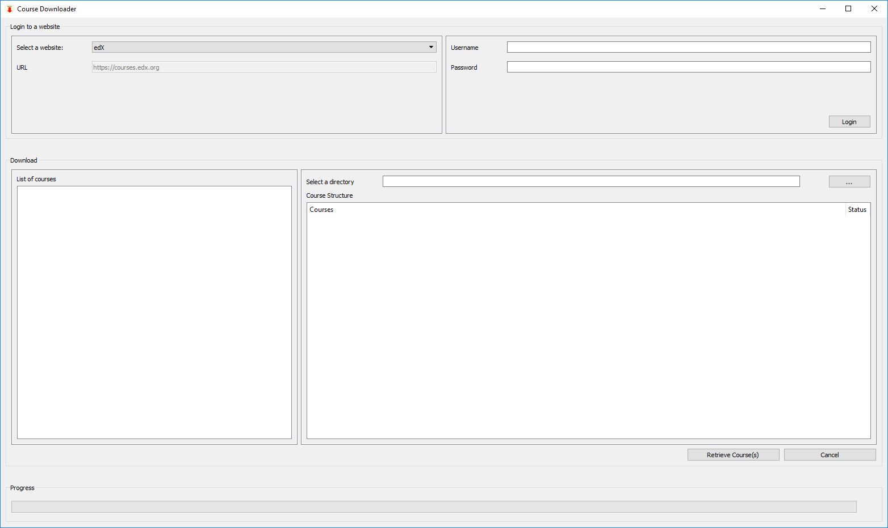

# course-downloader
A GUI tool to download videos from edX



---

## Important things to note
1. The tool is for edX site only (as of now)
2. The tool is just for downloading videos from the courses to which you have already enrolled in. You can't enroll to the courses within the tool.
3. It downloads the selected courses, and puts them into folders according to how it is structured on edX website. You have no control over the folder structure, except for the root folder. Video file names will be same as the title of the lecture preceded by an index.

---

## How to use the tool?
1. Download the latest release from [Releases page](https://github.com/Suhas-G/course-downloader/releases) if its available for your OS
2. Open the tool, and login using proper credentials.
3. Choose among the listed courses and press "Retrieve Course(s)"
4. Select a destination folder
5. Now press on "Download Course(s)" button.
6. Wait until it completes.

---

## How to setup on your machine?
1. Clone this [repository](https://github.com/Suhas-G/course-downloader.git)
2. Use anaconda to create a virtual environment from [environment.yaml](environment.yaml)
3. Or pip to install dependencies from [requirements.txt](requirements.txt)
4. Activate your environment if using virtual environment
5. This project is packaged using [fbs](https://github.com/mherrmann/fbs). So to run the program,
   1. To run the program use from console: ```python -m fbs run```
   2. To build and generate an executable: ```python -m fbs freeze```
   3. To create an installer, follow the steps given on [fbs tutorial](https://github.com/mherrmann/fbs-tutorial#creating-an-installer) page for your OS and then run ```python -m fbs installer```


